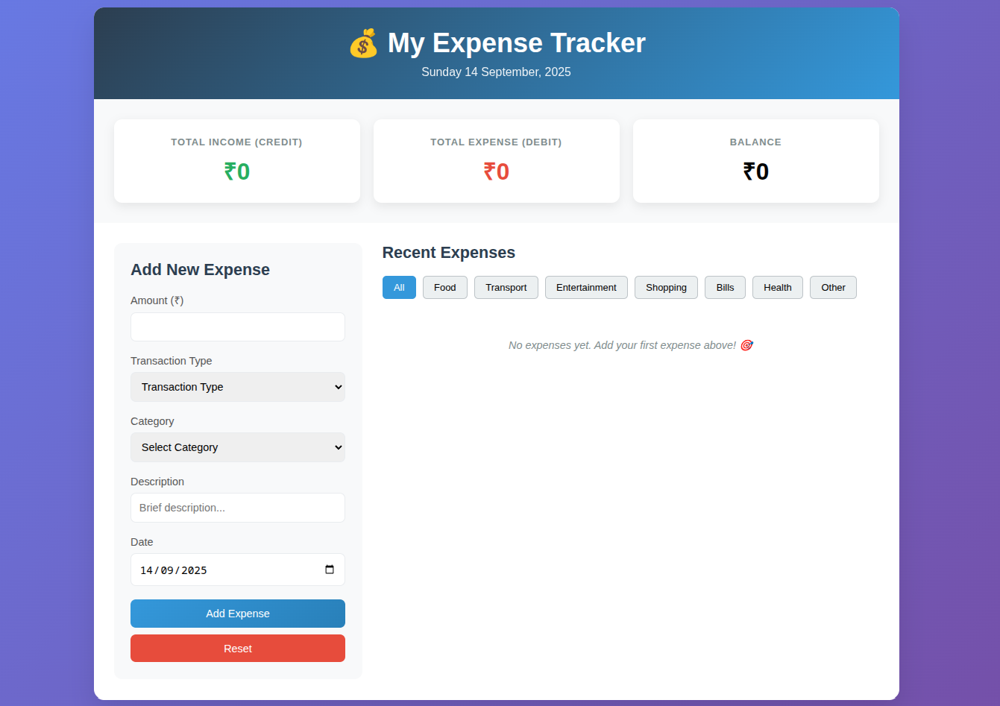

# Expense Manager

A lightweight, client-side expense tracker built with **HTML + CSS + JavaScript**. Log expenses/income, categorize them, filter by date/category, and persist data locally via `localStorage`.

## Demo / Screenshot



## Features

- Add, view, and delete transactions (income/expense)
- Category filters
- Local persistence via `localStorage`
- Friendly empty-state: “No expenses yet. Add your first expense above! 🎯”
- Reset-all with confirmation

## Tech Stack

- **Frontend:** Vanilla JS, HTML, CSS
- **Storage:** `localStorage` (JSON)
- **Formatting:** `Intl.DateTimeFormat`, `Intl.NumberFormat` (recommended)

## Getting Started

```bash
git clone https://github.com/saurhub-git/Expense-Manager.git
cd Expense-Manager
# just open index.html in a browser
```
